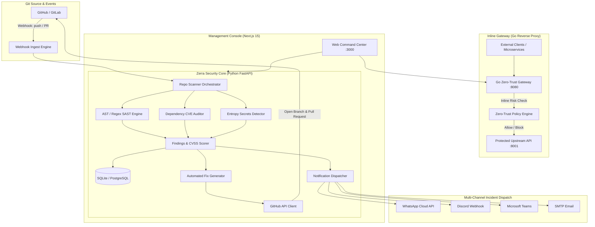

<div align="center">

# 🛡️ Zerra

### Autonomous Continuous Security & Auto-PR Platform

**Monitor repositories on every push/PR • Synthesize verified fixes into automated Pull Requests • Push instant alerts to WhatsApp, Discord, MS Teams & Email**

[](LICENSE)
[](.github/workflows/ci.yml)
[](https://python.org)
[](https://golang.org)
[](https://nextjs.org)
[](https://typescriptlang.org)
[](https://sarifweb.azurewebsites.net/)
[](CONTRIBUTING.md)

[Features](#-key-features) • [Architecture](#-architecture) • [Quickstart](#-quickstart) • [Integrations](#-notification-channels) • [API Reference](#-api-reference) • [Contributing](#-contributing)

</div>

---

## ⚡ Overview

**Zerra** is an open-source autonomous security engineering platform. It replaces passive security scanners with an active, continuous defense loop:

1. **Monitors repositories** continuously via GitHub Webhooks on every push and pull request.
2. **Executes triple-engine analysis**:
   - **SAST**: Static analysis detecting SQLi, Command Injection, XSS, Path Traversal, and Insecure Deserialization.
   - **SCA**: Software Composition Analysis auditing dependencies across `package.json`, `requirements.txt`, `go.mod`, `pom.xml`, and `Cargo.toml`.
   - **Secrets Detection**: High-entropy scanning identifying 25+ credential types (AWS, Stripe, GitHub PAT, Slack, OpenAI, Private Keys).
3. **Opens Automated Fix PRs**: Automatically synthesizes corrected code patches, generates an isolated branch, and opens a GitHub Pull Request with zero manual effort.
4. **Dispatches Real-time Alerts**: Instantly notifies on-call teams via **WhatsApp**, **Discord**, **Microsoft Teams**, and **Email**.
5. **Zero-Trust Inline Defense**: Integrates with a high-performance Go reverse proxy gateway to deploy instant virtual patches against active attacks.

---

## 🚀 Key Features

| Feature | Description |
| :--- | :--- |
| **🤖 Autonomous Fix PRs** | Automatically generates code patches and opens GitHub PRs with explanation, diff, and remediation guidance. |
| **🔍 Triple-Engine Scanner** | Full-spectrum analysis combining SAST, SCA, and Secret scanning in under 15 seconds. |
| **📱 Multi-Channel Push** | Native incident delivery to WhatsApp (Cloud API), Discord, MS Teams Adaptive Cards, and SMTP Email. |
| **🌐 Webhook-Native** | Zero-latency triggers on GitHub `push` and `pull_request` events. |
| **🛡️ Zero-Trust Gateway** | Reverse proxy mitigation with real-time identity trust scoring and inline virtual patch blocking (<1ms). |
| **📊 OASIS SARIF 2.1.0** | Industry-standard export compatible with GitHub Advanced Security and CI/CD pipelines. |
| **💾 Persistent Storage** | Lightweight SQLite / PostgreSQL persistence with thread-safe WAL mode and seed data. |
| **🎨 Modern Command Center** | Premium Next.js 15 dark-mode dashboard with real-time posture grades (A+ to F). |

---

## 🏗️ Architecture



---

## 🏁 Quickstart

### Option 1: Docker Compose (Recommended)

Run the full Zerra platform (Python Agent, Go Gateway, Next.js UI, and PostgreSQL) with a single command:

```bash
# Clone the repository
git clone https://github.com/sjsreehari/zerra.git
cd zerra

# Configure environment variables
cp .env.example .env

# Launch all microservices
docker-compose up -d --build
```

Access the dashboard at **http://localhost:3000**.

---

### Option 2: Local Development

#### 1. Start the Python Agent (Port 8000)

```bash
cd agent
python -m venv venv
source venv/bin/activate  # On Windows: .\venv\Scripts\activate
pip install -r requirements.txt

# Launch FastAPI server with SQLite persistence
uvicorn agent.api:app --host 0.0.0.0 --port 8000 --reload
```

#### 2. Start the Frontend Dashboard (Port 3000)

```bash
cd frontend
npm install
npm run dev
```

#### 3. Start the Go Gateway (Port 8080) *(Optional for inline defense)*

```bash
cd backend
go run main.go
```

---

## 💻 CLI Scanner

Scan any local repository or remote Git URL directly from your terminal:

```bash
# Scan current directory
python -m agent.scanner.repo_scanner --path .

# Scan remote GitHub repository with Deep mode
python -m agent.scanner.repo_scanner --repo https://github.com/sjsreehari/zerra --mode deep

# Export SARIF report
python -m agent.scanner.repo_scanner --path . --format sarif --output results.sarif
```

---

## 🔔 Notification Channels

Configure your alerting channels in `.env`:

### 💬 WhatsApp (Meta Cloud API)
```env
WHATSAPP_PHONE_NUMBER_ID="109876543210987"
WHATSAPP_ACCESS_TOKEN="EAAxxxxxxx..."
WHATSAPP_RECIPIENT="+14155552671"
```

### 🎮 Discord
```env
DISCORD_WEBHOOK_URL="https://discord.com/api/webhooks/xxxx/yyyy"
```

### 👥 Microsoft Teams
```env
TEAMS_WEBHOOK_URL="https://outlook.office.com/webhook/xxxx/IncomingWebhook/yyyy"
```

### ✉️ Email (SMTP)
```env
SMTP_HOST="smtp.mailgun.org"
SMTP_PORT="587"
SMTP_USER="postmaster@yourdomain.com"
SMTP_PASSWORD="secret_password"
NOTIFICATION_EMAIL_TO="security-team@yourdomain.com"
```

Test all channels instantly from CLI or UI:
```bash
curl -X POST http://localhost:8000/v1/notifications/test
```

---

## 🤖 GitHub Auto-PR Configuration

To enable automated remediation PRs:

1. Create a GitHub Personal Access Token (PAT) with `repo` permissions.
2. Export your token:
   ```bash
   export GITHUB_TOKEN="ghp_yourPersonalAccessTokenHere"
   ```
3. Register your repository in Zerra:
   ```bash
   curl -X POST http://localhost:8000/v1/repos \
     -H "Content-Type: application/json" \
     -d '{"url": "https://github.com/your-org/your-repo", "branch": "main", "auto_scan": true}'
   ```
4. Point your GitHub Webhook to:
   ```
   Payload URL: http://your-zerra-host:8000/v1/webhooks/github
   Content type: application/json
   Events: Just the push event & Pull requests
   ```

When a vulnerability is detected, Zerra commits the fix to branch `zerra/fix-<id>` and submits a comprehensive Pull Request.

---

## 🔌 API Reference

| Method | Endpoint | Description |
| :--- | :--- | :--- |
| `POST` | `/v1/repos` | Register repository for webhook monitoring |
| `GET` | `/v1/repos` | List monitored repositories with security grades |
| `DELETE`| `/v1/repos/{id}` | Remove repository from monitoring |
| `POST` | `/v1/repos/{id}/scan` | Trigger immediate scan on repository |
| `POST` | `/v1/scan` | Direct ad-hoc scan without registration |
| `GET` | `/v1/scans` | List scan execution history |
| `GET` | `/v1/scans/{id}` | Retrieve scan details and full findings |
| `GET` | `/v1/scans/{id}/sarif` | Export OASIS SARIF 2.1.0 compliant report |
| `GET` | `/v1/findings` | Unified findings explorer with severity filter |
| `POST` | `/v1/findings/{id}/create-pr` | **Trigger automated GitHub Pull Request fix** |
| `POST` | `/v1/webhooks/github` | GitHub webhook receiver (push & PR events) |
| `POST` | `/v1/notifications/test` | Test active notification channels |
| `GET` | `/v1/dashboard/stats` | Executive metrics, posture score, and timeline |

---

## 🛡️ Supported Languages & Detection Matrix

| Category | Detectors | Targets |
| :--- | :--- | :--- |
| **SAST** | AST & High-Precision Heuristics | Python, TypeScript, JavaScript, Go, Java, Dockerfile |
| **SCA** | CVE Vulnerability Database | npm (`package.json`), pip (`requirements.txt`), Go (`go.mod`), Maven (`pom.xml`), Cargo (`Cargo.toml`) |
| **Secrets** | Regex & Shannon Entropy | AWS Access Keys, Stripe Secret Keys, GitHub PATs, Slack Webhooks, OpenAI Keys, Private Keys, JWTs, Generic API Tokens |

---

## 🤝 Contributing

We welcome contributions from the global cybersecurity and open-source community!

- See [CONTRIBUTING.md](CONTRIBUTING.md) for local development setup, coding guidelines, and pull request procedures.
- Please review our [Code of Conduct](CODE_OF_CONDUCT.md).

---

## 📄 License

Zerra is licensed under the **[Apache License 2.0](LICENSE)**.
